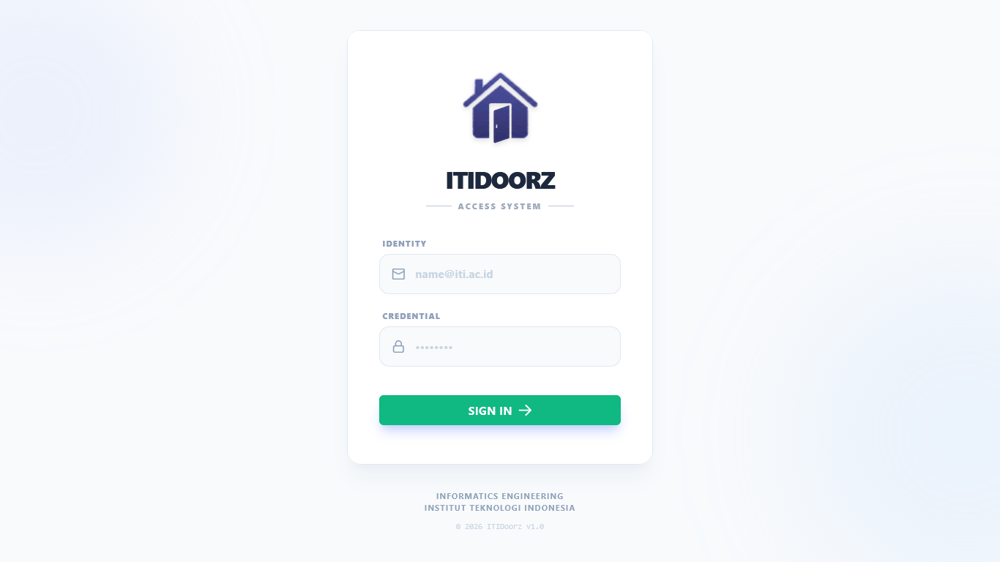
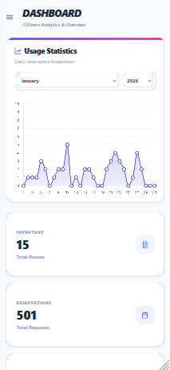

# 🚪 ITIDoorz - Campus Facility Booking System

 
**ITIDoorz** is a modern, full-stack web application designed to streamline the scheduling and management of classrooms and laboratories at **Institut Teknologi Indonesia (ITI)**. 

Built to solve scheduling conflicts, it empowers students and lecturers to easily book facilities while providing administrators with powerful tools for oversight, approval workflows, and usage reporting.

---

## 🛠️ Tech Stack

Engineered with performance and scalability in mind using industry-standard technologies.

### Backend (Server-side)
- **Language:** [Go (Golang)](https://go.dev/) - Chosen for high performance and concurrency.
- **Framework:** [Gin Gonic](https://gin-gonic.com/) - Fast HTTP web framework.
- **Database:** MySQL - Relational data management.
- **ORM/Driver:** SQLX - Secure and efficient database extensions.
- **Security:** JWT (JSON Web Tokens) & Bcrypt for secure authentication.
- **Documentation:** Swagger (Swaggo) - Interactive API docs.

### Frontend (Client-side)
- **Framework:** [Vue.js 3](https://vuejs.org/) (Composition API) - For a reactive user interface.
- **Styling:** Tailwind CSS - Utility-first CSS for rapid, responsive design.
- **State Management:** Vue Reactivity API.
- **Visualization:** Chart.js - Data visualization for admin analytics.
- **HTTP Client:** Axios - For seamless API integration.

---

## ✨ Key Features

### 🛡️ Admin Dashboard (The Control Center)
- **Visual Analytics:** Monthly room usage statistics visualized with interactive charts.
- **Inventory Control:** Complete CRUD (Create, Read, Update, Delete) for room management.
- **User Management:** Administer accounts for Admins and Users with secure role-based access.
- **Approval Workflow:** Review incoming booking requests and take action (**Approve** or **Reject**) instantly.
- **Report Generator:** Export detailed usage reports to **CSV** & **JSON** for offline analysis.

### 👤 User Panel (Lecturers & Staff)
- **Real-time Catalog:** Browse available rooms with capacity and facility details.
- **Instant Booking:** Submit reservation requests with specific dates and times.
- **Status Tracking:** Monitor the status of booking requests (Pending/Approved/Rejected).

### 🎨 UX/UI Excellence
- **📱 Mobile-First Design:** Optimized for touchscreens. Stat cards stack vertically on mobile and expand on desktop.
- **🍔 Adaptive Navigation:** Features a drawer menu on mobile and a sticky sidebar on desktop screens.
- **⚡ Reactive Feedback:** Instant form validation, loading states, and toast notifications for user actions.

---

## 📸 Application Preview

| Login Page | Admin Dashboard (Desktop) |
| :---: | :---: |
|  |  |

| User Booking Catalog | Mobile Responsive View |
| :---: | :---: |
|  |  |

---

## 🚀 Installation & Setup

Follow these steps to run the project locally.

### Prerequisites
- Go 1.20+
- Node.js & npm
- MySQL Server

### 1. Clone the Repository
```bash
git clone [https://github.com/MuhammadZaidan1/booking-system-go-vue.git](https://github.com/MuhammadZaidan1/booking-system-go-vue.git)
cd booking-system-go-vue